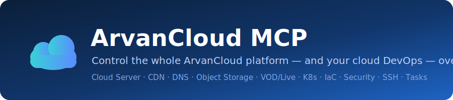
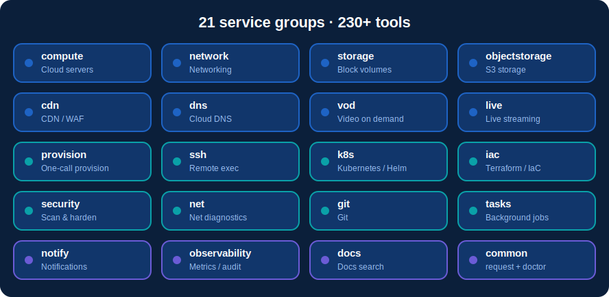
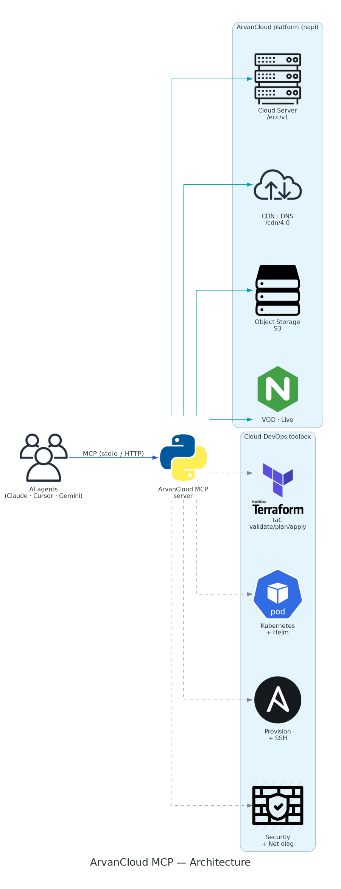
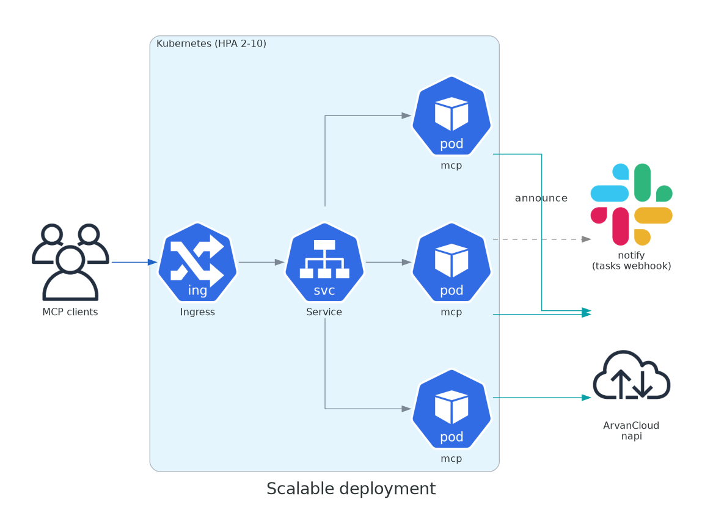
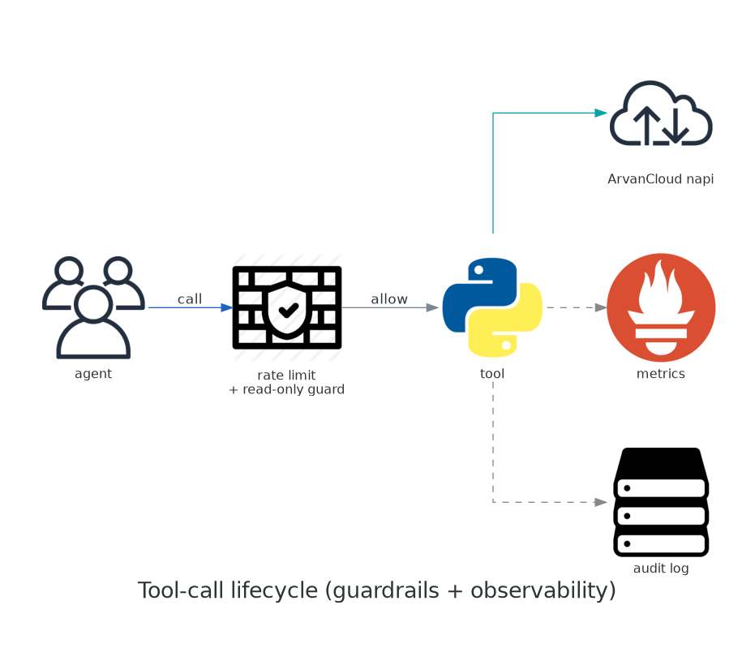
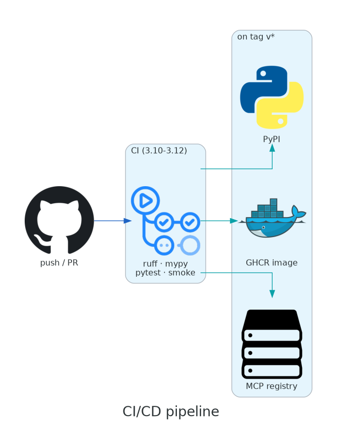
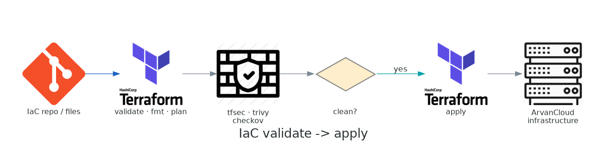
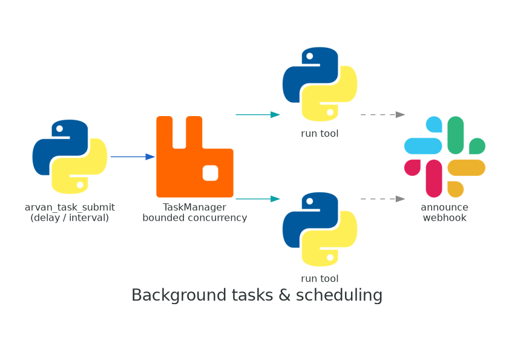
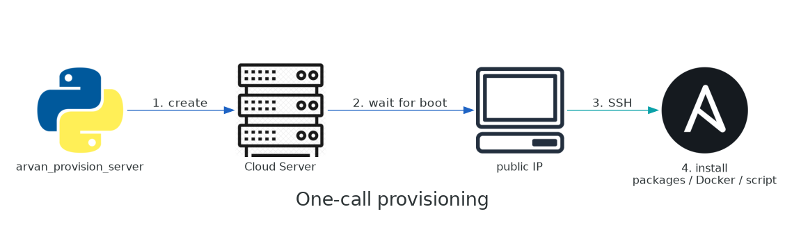

<p align="center">
  
</p>

<h1 align="center">ArvanCloud MCP Server</h1>

<p align="center">
  
  
  
  
  
</p>

A [Model Context Protocol](https://modelcontextprotocol.io) (MCP) server that
gives MCP-compatible clients — Claude Desktop, Claude Code, Cursor, VS Code,
Gemini CLI, and any other MCP host — full control of the
[ArvanCloud](https://www.arvancloud.ir) platform through natural language, plus a
cloud-DevOps toolbox (provisioning, Kubernetes, IaC, security, networking, tasks).

It talks to ArvanCloud's unified API (**`napi`**, `https://napi.arvancloud.ir`)
and exposes both **ergonomic, typed tools** for the common operations of every
product **and** a **generic escape-hatch tool** that can reach *any* endpoint —
so the whole platform is usable, today and as the API grows.

> Independent, community-built integration. Not an official ArvanCloud product.

## Covered products

**220+ tools across 20 service groups** — the whole ArvanCloud platform plus a
cloud-DevOps toolbox: provision a server, SSH in, validate IaC, deploy to
Kubernetes, scan for security issues, run networking diagnostics, schedule
background jobs, and send notifications — with guardrails, metrics, and reusable
workflow prompts on top.

ArvanCloud platform:

| Service group | Tools cover | API base |
|---|---|---|
| **compute** | Cloud Servers (Abrak): create/delete, power & maintenance actions, rename/rebuild/resize, `wait_for_server`, images, plans, quotas, SSH keys, tags, server↔security-group, PTR | `/ecc/v1` |
| **network** | Private networks & subnets (CRUD), security groups & rules, floating IPs (incl. delete), port security | `/ecc/v1` |
| **storage** | Block volumes & snapshots, attach/detach, limits | `/ecc/v1` |
| **objectstorage** | S3-compatible: buckets, objects (text/binary), copy, presigned URLs, policies/ACLs | `s3.<region>.arvanstorage.ir` |
| **cdn** | Domains, caching, purge, page rules, firewall/WAF, rate-limit, log forwarders, metric exporters, SSL, apps (CRUD + webhook) | `/cdn/4.0` |
| **dns** | DNS records (A/CNAME helpers), cloud/proxy toggle, zone import, DNSSEC | `/cdn/4.0` |
| **vod** | Channels, videos, audios, subtitles, watermarks, profiles, files, user domain (full CRUD) | `/vod/2.0` |
| **live** | Live Streaming channels & inputs | `/live/2.0` |

DevOps & automation toolbox:

| Service group | Tools cover |
|---|---|
| **ssh** | Run commands/scripts, upload/download files, connection checks (asyncssh) |
| **provision** | `arvan_provision_server`: create + wait + SSH-install / cloud-init in one call |
| **k8s** | `kubectl` apply/delete/get, generic kubectl, Helm install/uninstall (any cluster incl. ArvanCloud PaaS) |
| **iac** | Terraform validate/fmt/plan/apply/destroy, tflint, checkov, kubeconform, kube-linter, hadolint, yamllint, trivy |
| **security** | Secret/vuln/SBOM/SAST scans (gitleaks, trivy, syft, semgrep), security-group auditing, HTTP-header grading, password & SSH-keypair generation |
| **net** | DNS, reverse DNS, TCP/port checks, HTTP checks, TLS-cert inspection, ping/traceroute/whois, HTTP load test |
| **git** | Clone & inspect repos (validate/deploy IaC from a repo) |
| **tasks** | Run any tool in the **background**, on a delay or recurring schedule; poll status; **announce** completion via webhook |
| **notify** | Send messages to Slack, Telegram, a generic webhook, or email (SMTP) |
| **observability** | `arvan_metrics` (JSON + Prometheus), `arvan_audit_log`, optional per-minute rate limiting |
| **common** | `arvan_request` (reach **any** endpoint), `arvan_capabilities`, `arvan_doctor`, plus workflow **prompts** & live **resources** |

**Guardrails:** every tool is annotated `readOnlyHint`/`destructiveHint` so clients
can tell safe from dangerous calls. Set `ARVAN_READ_ONLY=true` to expose only
read tools (and restrict `arvan_request` to GET), or scope the surface with
`ARVAN_TOOLS_ALLOW` / `ARVAN_TOOLS_DENY` (glob lists).

**Prompts & resources:** reusable prompts (`provision_web_server`,
`audit_security`, `setup_cdn`, `deploy_static_site`) and live MCP resources
(`arvan://regions`, `arvan://servers/{region}`, `arvan://domains`,
`arvan://capabilities`).

`iam` and `container` (Kubernetes PaaS) are documentation pointers — manage them
via the panel / `kubectl` / `arvan_request`.

**100% napi coverage:** the generic `arvan_request` tool can call any ArvanCloud
endpoint and `arvan_capabilities` lists them, so nothing is out of reach even
without a dedicated typed tool. Run `arvan_doctor` to see what's configured and
which optional CLI tools are installed.

<p align="center"></p>

## Architecture

<p align="center"></p>

AI agents talk to the server over MCP (stdio locally, or streamable-HTTP when
deployed). The server wraps ArvanCloud's `napi` for the platform products and
shells out to standard tools (terraform, kubectl, ansible, trivy, …) for the
DevOps toolbox. For many concurrent users it runs stateless behind a load
balancer and scales horizontally:

<p align="center"></p>

Every tool call flows through the same guardrails + observability path:

<p align="center"></p>

> Diagrams are generated with the [`diagrams`](https://diagrams.mingrammer.com/)
> library — regenerate with `make diagrams` (needs Graphviz).

## Requirements

- Python 3.10+
- An ArvanCloud **machine-user access key** (create one in the panel under
  *Settings → Machine User / API keys*). See the
  [API usage docs](https://docs.arvancloud.ir/en/developer-tools/api/api-usage).

## Install

```bash
git clone https://github.com/dwin-gharibi/arvancloud-mcp.git
cd arvan-temp
pip install .          # or:  pip install -e ".[dev]"  for development
```

## Configure

All configuration is via environment variables (see `.env.example`):

| Variable | Default | Description |
|---|---|---|
| `ARVAN_API_KEY` | — | **Required.** Machine-user access key. The `Apikey ` prefix is added automatically. |
| `ARVAN_BASE_URL` | `https://napi.arvancloud.ir` | API host (use the `.com` alias if needed). |
| `ARVAN_DEFAULT_REGION` | — | Default IaaS region, e.g. `ir-thr-c2`, so you don't repeat it. |
| `ARVAN_ENABLED_SERVICES` | `all` | Comma list of tool groups to expose (`common` is always on). |
| `ARVAN_TIMEOUT` | `60` | Per-request timeout (seconds). |
| `ARVAN_MAX_RETRIES` | `4` | Retries for network errors / `429` / `5xx`. |
| `ARVAN_BACKOFF_FACTOR` | `1.0` | Exponential backoff base (seconds). |
| `ARVAN_VERIFY_SSL` | `true` | TLS verification. |
| `ARVAN_TRANSPORT` | `stdio` | `stdio`, `sse`, or `streamable-http`. |
| `ARVAN_HOST` / `ARVAN_PORT` | `127.0.0.1` / `8000` | Bind address for HTTP transports. |
| `ARVAN_S3_ACCESS_KEY` / `ARVAN_S3_SECRET_KEY` | — | Object Storage credentials (separate from the API key). |
| `ARVAN_S3_REGION` / `ARVAN_S3_ENDPOINT` | `ir-thr-at1` | S3 region (selects the endpoint) or an explicit endpoint URL. |
| `ARVAN_SSH_USER` | `root` | Default SSH user for the remote-exec tools. |
| `ARVAN_SSH_KEY` / `ARVAN_SSH_KEY_FILE` / `ARVAN_SSH_PASSWORD` | — | Default SSH auth (inline key, key file, or password). |
| `ARVAN_SSH_PORT` / `ARVAN_SSH_KNOWN_HOSTS` / `ARVAN_SSH_TIMEOUT` | `22` / off / `30` | SSH port, host-key file (off = no verification), connect timeout. |

## Run

### Local (stdio) — for Claude Desktop / Claude Code

```bash
export ARVAN_API_KEY="your-machine-user-key"
export ARVAN_DEFAULT_REGION="ir-thr-c2"
arvancloud-mcp                      # or:  python -m arvancloud_mcp
```

See **[Add it to your AI agent](#add-it-to-your-ai-agent)** below for per-client setup.

### Networked (HTTP) — for remote/shared deployments

```bash
ARVAN_API_KEY=your-key ARVAN_TRANSPORT=streamable-http ARVAN_HOST=0.0.0.0 \
  arvancloud-mcp
# Streamable-HTTP endpoint: http://localhost:8000/mcp
```

### Docker

```bash
docker build -t arvancloud-mcp .
docker run --rm -p 8000:8000 -e ARVAN_API_KEY=your-key arvancloud-mcp
```

Or with Compose (reads `ARVAN_API_KEY` from your environment or `.env`):

```bash
ARVAN_API_KEY=your-key docker compose up --build
```

To bundle the IaC/security validators (terraform, checkov, hadolint, trivy, …):

```bash
docker build --build-arg INSTALL_IAC_TOOLS=true -t arvancloud-mcp:iac .
```

## Add it to your AI agent

All of these run the server over stdio. Install it first (`pip install arvancloud-mcp`)
so the `arvancloud-mcp` command is on PATH.

**Claude Desktop** — `claude_desktop_config.json`:

```json
{
  "mcpServers": {
    "arvancloud": {
      "command": "arvancloud-mcp",
      "env": { "ARVAN_API_KEY": "Apikey ...", "ARVAN_DEFAULT_REGION": "ir-thr-c2" }
    }
  }
}
```

**Claude Code** (CLI):

```bash
claude mcp add arvancloud --env ARVAN_API_KEY="Apikey ..." -- arvancloud-mcp
```

**Cursor** — `~/.cursor/mcp.json` (or `.cursor/mcp.json` in a project):

```json
{
  "mcpServers": {
    "arvancloud": { "command": "arvancloud-mcp", "env": { "ARVAN_API_KEY": "Apikey ..." } }
  }
}
```

**VS Code** — `.vscode/mcp.json`:

```json
{
  "servers": {
    "arvancloud": { "type": "stdio", "command": "arvancloud-mcp", "env": { "ARVAN_API_KEY": "Apikey ..." } }
  }
}
```

**Gemini CLI** — `~/.gemini/settings.json`:

```json
{
  "mcpServers": {
    "arvancloud": {
      "command": "arvancloud-mcp",
      "env": { "ARVAN_API_KEY": "Apikey ..." },
      "timeout": 60000
    }
  }
}
```

> Tip: for a safe, sharable setup, add `"ARVAN_READ_ONLY": "true"` to `env` so only
> read tools are exposed, or scope with `ARVAN_TOOLS_ALLOW` / `ARVAN_TOOLS_DENY`.
> Remote (HTTP) clients point at `http://<host>:8000/mcp` instead of a command.

## Deploy & scale

Production manifests live in [`deploy/`](deploy/README.md): **Kubernetes** with an
HPA (`deploy/kubernetes`, `kubectl apply -k`), a **Helm chart**
(`deploy/helm/arvancloud-mcp`), and **Terraform** that provisions an ArvanCloud
server running the MCP (`deploy/terraform`). For many concurrent loads, run the
HTTP transport with `ARVAN_STATELESS_HTTP=true` `ARVAN_JSON_RESPONSE=true` and
scale replicas (the HPA does 2→10 on CPU/memory).

## CI/CD

GitHub Actions in [`.github/workflows`](.github/workflows):
- **`ci.yml`** — ruff + mypy + pytest (with coverage) + the MCP smoke test, on Python 3.10–3.12.
- **`docker.yml`** — build & push the image to GHCR.
- **`security.yml`** — Trivy filesystem scan.
- **`release.yml`** — on a `v*` tag: build & publish to PyPI, create a GitHub
  release, and publish to the MCP registry (see [Publishing](#publishing--marketplaces)).

<p align="center"></p>

## Usage examples (what you can ask)

Platform:
- *"List my cloud servers in ir-thr-c2 and power off the one named staging."*
- *"Create an A record for `www` on `example.com` → `1.2.3.4`, proxied; enable free SSL."*
- *"Add a 50 GB volume and attach it to server `abcd`."*
- *"Upload `./site` to bucket `assets` and host it as a static website."*
- *"Purge the CDN cache for `example.com` and show the caching settings."*

DevOps:
- *"Provision a 2-CPU Ubuntu server, install Docker, and Slack me when it's ready."*
- *"Validate this Terraform and show the plan; if it's clean, apply it."* → `arvan_iac_*`:

<p align="center"></p>

- *"Apply `deploy/kubernetes` to my cluster with this kubeconfig."* → `arvan_k8s_apply`.
- *"Audit my security groups and grade `https://example.com` headers."* → `arvan_security_*`.
- *"Load-test `https://example.com` with 200 requests at concurrency 20."* → `arvan_net_http_load_test`.
- *"Search the ArvanCloud docs for DNSSEC and summarise the page."* → `arvan_docs_*`.

Meta:
- *"What ArvanCloud features can you control?"* → `arvan_capabilities`.
- *"Find the tool for floating IPs."* → `arvan_find_tool`.
- *"Is everything configured?"* → `arvan_doctor`. *"Show tool metrics."* → `arvan_metrics`.

### Background jobs & scheduling

<p align="center"></p>

Long-running work (provisioning, IaC apply, scans, load tests) can run in the
background so the conversation isn't blocked:

```text
arvan_task_submit(tool="arvan_provision_server", arguments={...},
                  announce_webhook="https://hooks.example.com/done")
# -> returns a task id immediately; poll with arvan_task_status, or get a
#    webhook POST when it finishes. Recurring schedules: interval_seconds=3600.
```

Concurrency and history are bounded (`ARVAN_TASK_MAX_CONCURRENCY`,
`ARVAN_TASK_MAX_TASKS`); the webhook announcement is replica-independent, so it
works behind a load balancer at scale.

### End-to-end: provision a server and configure it

> *"Spin up a small Ubuntu server in ir-thr-c2, then install nginx on it."*

<p align="center"></p>

`arvan_provision_server` does this in one call, or the model can chain:

1. `arvan_list_plans` + `arvan_list_images` → pick a flavor and Ubuntu image.
2. `arvan_create_ssh_key` (or reuse) → `arvan_create_server(..., ssh_key_name=...)`.
3. `arvan_wait_for_server` → waits until it's active and returns the public IP.
4. `arvan_ssh_run_script(host=ip, script="apt-get update && apt-get install -y nginx")`.

That's the full lifecycle — buy → boot → SSH in → run commands — in one place.

### The generic tool

For anything not wrapped explicitly (e.g. Live Streaming, or new endpoints):

```text
arvan_request(method="GET", path="/live/2.0/channels")
arvan_request(method="POST", path="/cdn/4.0/domains/example.com/page-rules",
              body={"url": "example.com/*", "actions": {"cache_level": "bypass"}})
```

Discover paths first with `arvan_capabilities("cdn")`, `arvan_capabilities("vod")`, etc.

## Notes on Object Storage, SSH, IAM & Containers

- **Object Storage** is **S3-compatible** (`https://s3.<region>.arvanstorage.ir`)
  and uses its own access/secret key. The `arvan_s3_*` tools wrap it via boto3
  — set `ARVAN_S3_ACCESS_KEY` / `ARVAN_S3_SECRET_KEY` (+ region/endpoint).
- **SSH** tools run real commands on your servers. Host-key verification is
  **off by default** (freshly provisioned servers aren't in any known_hosts);
  set `ARVAN_SSH_KNOWN_HOSTS` to enforce it. Treat command execution as
  privileged — confirm intent before running destructive commands.
- **IAM** (machine users, roles) and **Cloud Container** (Kubernetes PaaS,
  driven by `kubectl`/`oc`) aren't wrapped as typed tools; manage IAM via the
  panel or `arvan_request`, and Containers via the Kubernetes API.

## Development & tests

```bash
pip install -e ".[dev]"
pytest
```

The test suite runs fully offline: HTTP is mocked with `respx`, and the boto3
(Object Storage) and asyncssh (SSH) clients are stubbed. It verifies auth header
normalization, retry/backoff, error handling, region defaulting, request-body
construction (incl. multipart zone import), Object Storage put/get/list,
SSH run/script/upload/download, config parsing, tool registration, and the
generic request path.

## Project layout

```
src/arvancloud_mcp/
  config.py        # env-driven settings (API, S3, SSH, transport)
  client.py        # async httpx client: auth, retries, JSON+multipart, errors
  catalog.py       # machine-readable API catalogue (powers arvan_capabilities)
  server.py        # FastMCP assembly + transport selection
  tools/
    common.py        # generic request + capabilities
    compute.py       # servers, actions, images, plans, ssh-keys, tags, wait
    network.py       # networks, security groups, floating IPs, ports
    storage.py       # block volumes & snapshots
    objectstorage.py # S3 buckets & objects (boto3)
    cdn.py           # domains, caching, rules, rate-limit, observability
    dns.py           # records, cloud toggle, zone import, DNSSEC
    vod.py / live.py # video on demand / live streaming
    ssh.py           # run commands & transfer files over SSH (asyncssh)
tests/             # offline tests (respx + mocked boto3/asyncssh)
```

## Publishing & marketplaces

The repo is set up to publish itself:

- **PyPI** — `release.yml` builds and publishes `arvancloud-mcp` on a `v*` tag
  (PyPI Trusted Publishing; no token in the repo). Most MCP marketplaces
  (Glama, PulseMCP, mcp.so, Smithery) index from PyPI/GitHub automatically.
- **Official MCP Registry** — [`server.json`](server.json) is the registry
  manifest (`io.github.dwin-gharibi/arvancloud-mcp`). The release workflow runs
  `mcp-publisher` (GitHub OIDC) to publish it; the `mcp-name` marker is embedded
  at the top of this README for PyPI validation. See the
  [registry publishing guide](https://github.com/modelcontextprotocol/registry/blob/main/docs/guides/publishing/publish-server.md).

To cut a release: bump `version` in `pyproject.toml`, `server.json`, and the
badge, then `git tag v0.1.0 && git push --tags`.

## License

MIT — see [LICENSE](LICENSE).

<p align="center">
  
</p>
